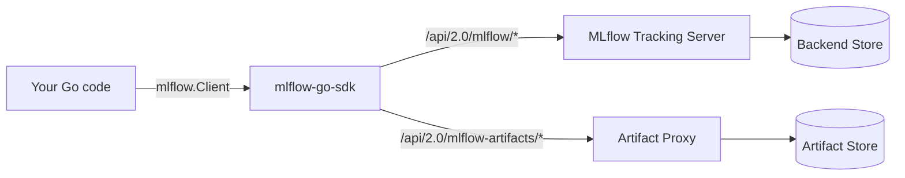
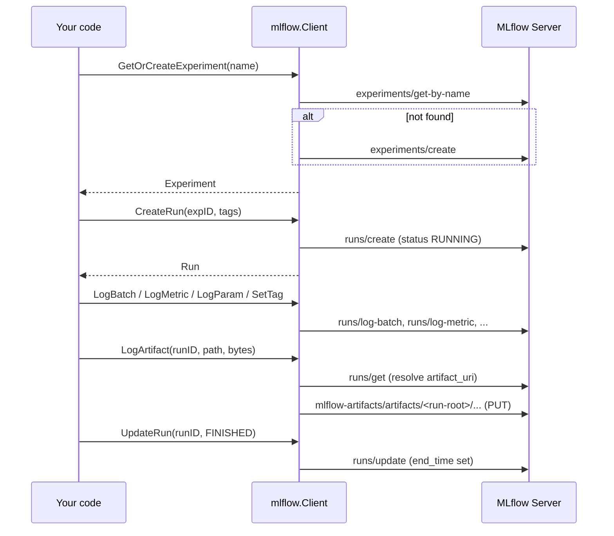
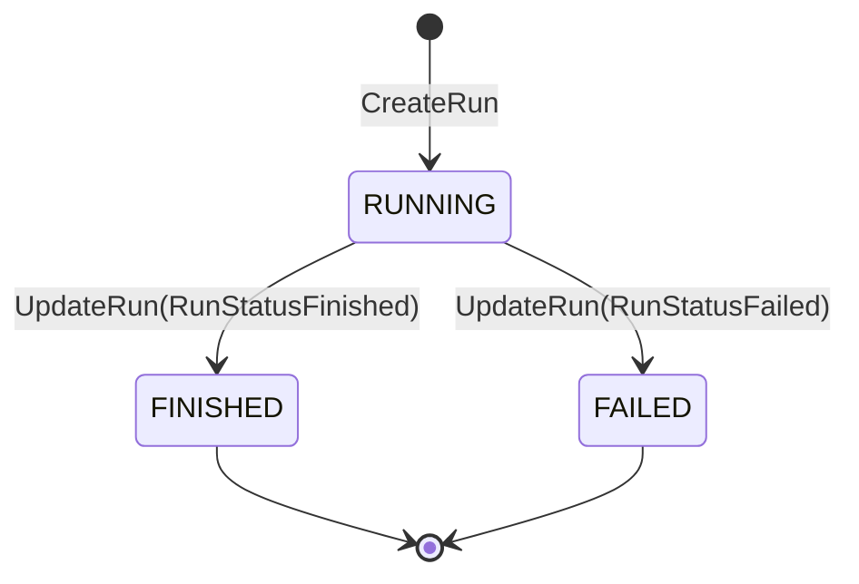

# mlflow-go-sdk

A minimal Go client for the [MLflow](https://mlflow.org) 3.x tracking REST API.

Covers experiments, runs, params/metrics/tags, and proxied artifact upload —
the subset needed by NUH evaluation pipelines. Not a comprehensive MLflow SDK.

## Install

```bash
go get github.com/NUH-Clinical-Innovation-Office/mlflow-go-sdk/pkg/mlflow
```

## Quick start

```go
package main

import (
    "context"
    "log"

    "github.com/NUH-Clinical-Innovation-Office/mlflow-go-sdk/pkg/mlflow"
)

func main() {
    ctx := context.Background()
    c := mlflow.New(mlflow.Options{TrackingURI: "http://localhost:5000"})

    exp, err := c.GetOrCreateExperiment(ctx, "My Experiment")
    if err != nil {
        log.Fatal(err)
    }

    run, err := c.CreateRun(ctx, exp.ExperimentID, nil)
    if err != nil {
        log.Fatal(err)
    }

    _ = c.LogMetric(ctx, run.Info.RunID, "accuracy", 0.91, 0)
    _ = c.UpdateRun(ctx, run.Info.RunID, mlflow.RunStatusFinished)
}
```

## How it fits together

The client is a thin wrapper over the MLflow tracking server. Every method maps
to one REST call; artifacts go through the server's artifact proxy rather than
directly to blob storage.



## Run lifecycle

A typical evaluation run resolves an experiment, opens a run, logs data, then
closes the run with a terminal status.



Run status transitions the SDK supports:



## Examples

### Log a batch of params, metrics, and tags

`LogBatch` sends everything in one request. Metrics with a zero `Timestamp` are
stamped with the current time. MLflow caps a batch at 1000 metrics, 100 params,
and 100 tags — chunk larger sets yourself.

```go
err := c.LogBatch(ctx, run.Info.RunID,
    []mlflow.Param{{Key: "model", Value: "opus-4-8"}},
    []mlflow.Metric{{Key: "accuracy", Value: 0.93}},
    []mlflow.RunTag{{Key: "phase", Value: "eval"}},
)
```

### Upload an artifact

Requires the tracking server to run with `--serve-artifacts`. The path is
run-relative; nested paths are created as needed.

```go
err := c.LogArtifact(ctx, run.Info.RunID, "reports/summary.json", []byte(`{"ok":true}`))
```

### Per-call tracing (flag-gated)

Go has no decorators; `Traced` is the idiomatic equivalent — wrap a call and
toggle logging with a flag (config default or per-call override), so you trace
some steps and skip others within the same run. When enabled it logs
`<name>.duration_ms` and a `trace.<name>` tag of `ok`/`error`; `fn`'s error is
always authoritative — a logging failure never hides it.

```go
cfg := struct{ Trace bool }{Trace: true}

_ = c.Traced(ctx, run.Info.RunID, "extraction", cfg.Trace, func(ctx context.Context) error {
    return doExtraction(ctx) // logs extraction.duration_ms + trace.extraction=ok/error
})

_ = c.Traced(ctx, run.Info.RunID, "judge", false, func(ctx context.Context) error {
    return doJudge(ctx) // enabled=false → passthrough, nothing logged
})
```

### Authentication

Authentication is optional in the SDK. Plain local MLflow servers usually do
not require a token, so leave `Token` empty. Protected deployments, such as
Panacea's `/mlflow` proxy, require a bearer token so Panacea can authenticate
the caller before forwarding traces, metrics, params, runs, and artifacts to
MLflow.

Set `Token` to send an `Authorization: Bearer` header on every call:

```go
c := mlflow.New(mlflow.Options{
    TrackingURI: os.Getenv("MLFLOW_TRACKING_URI"),
    Token:       os.Getenv("MLFLOW_TRACKING_TOKEN"),
})
```

For Panacea, mint the MLflow token from the auth service
(`POST /api/v1/tokens/mlflow`) and pass the returned token as
`MLFLOW_TRACKING_TOKEN`.

The SDK identifies every tracking and artifact request as
`mlflow-go-client/<version>`. This avoids protected reverse proxies treating
Go's generic `Go-http-client/2.0` default as an unsupported automated client
and returning an HTML `403 Forbidden` before MLflow can validate the bearer
token.

## API surface

| Method | MLflow endpoint |
|--------|-----------------|
| `GetExperimentByName` | `experiments/get-by-name` |
| `CreateExperiment` | `experiments/create` |
| `GetOrCreateExperiment` | get-by-name, then create if absent |
| `CreateRun` | `runs/create` |
| `GetRun` | `runs/get` |
| `UpdateRun` | `runs/update` |
| `SetTag` | `runs/set-tag` |
| `LogParam` | `runs/log-parameter` |
| `LogMetric` | `runs/log-metric` |
| `LogBatch` | `runs/log-batch` |
| `LogArtifact` | `runs/get` then `mlflow-artifacts/artifacts/<run-root>/...` (proxy) |
| `Traced` | wraps `LogMetric` + `SetTag` |

Non-2xx responses are returned as `*mlflow.APIError` (carrying `StatusCode`,
`ErrorCode`, and `Message`); use `errors.As` to inspect them.

## Error handling

```go
exp, err := c.GetExperimentByName(ctx, "nope")
var apiErr *mlflow.APIError
if errors.As(err, &apiErr) && apiErr.ErrorCode == "RESOURCE_DOES_NOT_EXIST" {
    // handle missing experiment
}
```

## Development

```bash
make test     # go test -race ./...
make lint     # golangci-lint
make example  # live smoke test (needs MLFLOW_TRACKING_URI)
```

See `example/` for a full runnable smoke test.
